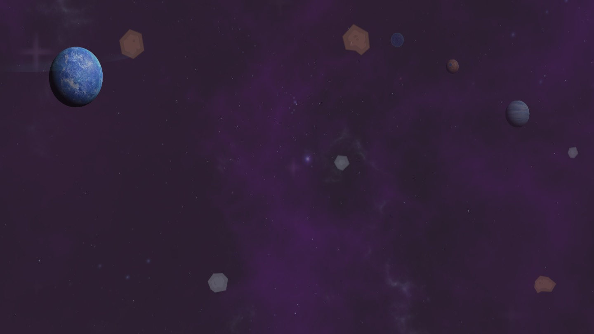
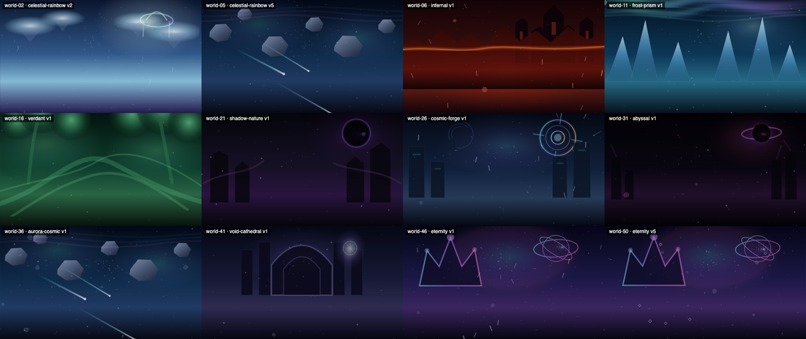
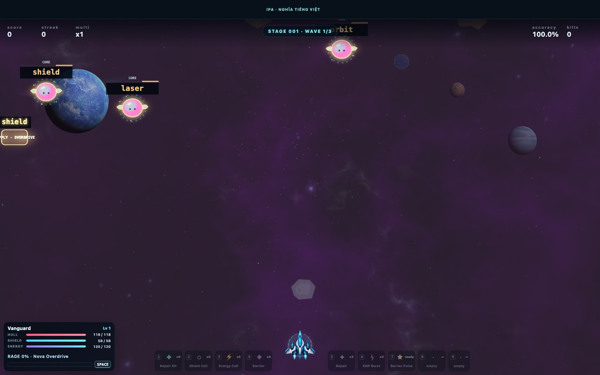

# Kế hoạch làm lại hình nền Space Typing — Background Visual Reboot (BGV)

> **Trạng thái:** ĐÃ DUYỆT HƯỚNG ĐI (2026-09-26) — đang làm Giai đoạn A (ảnh Galaxy 01) và Giai đoạn B (lõi kỹ thuật).
>
> **Ngày:** 2026-09-26.
>
> **Quyết định đã chốt (chủ dự án, 2026-09-26):**
> 1. **Nguồn ảnh: ChatGPT (Images 2.0/2.5), phong cách game giả tưởng** — phong phú, đẹp, huyền ảo. Ảnh thiên văn thật không đủ chất giả tưởng nên **không dùng làm ảnh chính thức** (chỉ có thể xem để lấy cảm hứng).
> 2. **Chỉ dùng cá nhân**, không bán, không phát hành. Không cần màn Credits; vẫn ghi nguồn gốc ảnh trong manifest theo quy định của dự án.
> 3. **Bộ vẽ: WebGL2 tự viết** (không thêm thư viện), ưu tiên rẻ tài nguyên và đẹp.
> 4. **Làm thử Galaxy 01 trước**, duyệt xong mới làm các Galaxy khác.
> 5. **Bộ ảnh đầy đủ: 11 ảnh mỗi Galaxy** (mục 6, bảng "Số lượng ảnh").
>
> Hướng dẫn tạo ảnh chi tiết cho Galaxy 01: [background-reboot/G01_CHATGPT_PROMPT_PACK.md](background-reboot/G01_CHATGPT_PROMPT_PACK.md).
>
> **Phạm vi:** hình nền chiến đấu của cả 50 World / 10 Galaxy.
>
> **Khi được duyệt**, tài liệu này thay thế *hướng mỹ thuật và cách vẽ* của 3 plan cũ:
> `WORLD_BACKGROUND_SCENE_SYSTEM_PLAN.md`, `CINEMATIC_BACKGROUND_SYSTEM_PLAN.md`,
> `LAYERED_BACKGROUND_ASSET_SYSTEM_PLAN.md`. Phần ánh xạ World → nhóm cảnh
> (`src/worlds/scene-registry.ts`) vẫn được giữ làm nguồn dữ liệu gốc.

---

## 0. Tóm tắt nhanh

**Vấn đề:** hình nền hiện tại xấu không phải vì thiếu code. Nó xấu vì **không có ảnh đẹp để vẽ**, và vì bố cục, ánh sáng, chuyển động đều sai.

- Nền Galaxy là một ô ảnh 256×256 px bị kéo giãn ra cả màn hình (phóng to 6–13 lần).
- Thiên thạch là sprite (ảnh nhỏ của một vật thể) kiểu hoạt hình phẳng, cỡ 28–120 px, vẽ ở độ đục 34–46%. Nhìn xuyên qua được.
- 9 Galaxy còn lại dùng 30 file SVG viết tay, mỗi file chỉ 436–820 byte (vài hình tròn, tam giác, chữ nhật).
- Ở Galaxy 02–10, 5 World trong cùng một Galaxy dùng chung đúng một bộ ảnh ở cùng vị trí, nên nhìn giống hệt nhau. (Galaxy 01 chia 5 World cho 3 bộ: Galaxy, Heaven, Meteor.)
- Đã có 98 commit chạm vào các file của hệ thống nền (renderer, registry, types, ảnh nền, 3 plan cũ, test nền; phần lớn trong 2 ngày 25–26/09) mà hình vẫn không đạt. Đếm hẹp hơn (chỉ renderer + ảnh) thì khoảng 66.

**Giải pháp có 3 trụ cột:**

1. **Ảnh do công cụ tạo ảnh làm ra, không do code vẽ.** Dùng lại đúng quy trình đã thành công với tàu V3: tạo ảnh bằng AI → chọn lọc → hậu kỳ → kiểm tra mã băm → đưa vào game. Bổ sung ảnh thiên văn thật (ESA/NASA) cho các màn vũ trụ sâu.
2. **Bộ vẽ nền riêng chạy bằng GPU (WebGL2 — giao diện vẽ bằng card đồ hoạ trong trình duyệt)**, tách khỏi canvas gameplay. Nền có 12 lớp chiều sâu, chuyển động parallax (lớp xa trôi chậm, lớp gần trôi nhanh), và các hiệu ứng shader (chương trình nhỏ chạy trên GPU) nhẹ: tinh vân cuộn chảy, sao lấp lánh, hành tinh tự quay có viền khí quyển, lỗ đen bẻ cong ánh sáng.
3. **Quy trình có cổng duyệt bằng mắt.** Làm thử Galaxy 01 trước. Mỗi bước hình ảnh phải có ảnh chụp đặt cạnh bảng ảnh tham khảo và được chủ dự án duyệt. "CI xanh" không còn được coi là "xong".

**Hiệu năng:** chuyển việc nặng sang GPU. Luồng chính dành cho nền ≤ 0,5 ms mỗi khung hình (đo được 0,2–0,3 ms; hệ cũ 0,7–1,0 ms), không giải mã hay nạp ảnh lớn trong lúc đang đánh. GPU vẫn **dùng chung** với gameplay, nên nền có ngân sách GPU đo bằng bộ đếm thời gian GPU (mục 9A) và tự hạ chất lượng trước gameplay khi máy chậm.

> **Lưu ý thẳng thắn:** AI viết code (ChatGPT hay Claude) đều **không tự vẽ tranh được**. Plan cũ thất bại vì bắt AI viết code giả làm tranh. Plan này chia rõ: phần tranh do công cụ tạo ảnh làm (hoặc lấy từ nguồn ảnh chất lượng cao có giấy phép rõ); AI viết code chỉ lo ghép lớp, chuyển động, hiệu ứng và hiệu năng. Mục 5.2 ghi rõ phần nào AI tự lấy được, phần nào cần bạn tạo ảnh.

---

## 1. Hiện trạng — bằng chứng đo được

### 1.1 Luồng vẽ hiện tại (mỗi khung hình)

Nền và gameplay vẽ chung **một canvas 2D** (`#gameCanvas`). Thứ tự trong `WorldSceneRenderer.draw()` ([scene-renderer.ts:2623](../src/worlds/scene-renderer.ts#L2623)):

1. Vẽ lớp "tĩnh" đã lưu sẵn: gradient, tinh vân vẽ bằng code, công trình vẽ bằng code, dấu hiệu riêng của từng World.
2. Vẽ các lớp ảnh (`LayeredBackgroundRenderer`). Lớp đầu tiên là ảnh bầu trời **đục 100%, phủ kín màn hình**.
3. Vẽ bằng code: sao, mây, cực quang, vòng lò phản ứng, thiên thạch đa giác, hạt bụi, vệt sao băng.

Hệ quả:

- Lớp tĩnh ở bước 1 (khoảng 1.185 dòng code, dòng 186–1371) **bị bước 2 che kín**. Người chơi gần như không bao giờ thấy nó.
- Khoảng 465 dòng code vẽ "sàn phối cảnh" (dòng 2097–2562) chỉ chạy khi ảnh chưa tải xong.
- Các thứ tạo khác biệt giữa 5 World (`landmarkStyle`, `floorStyle`...) nằm ở lớp bị che. Vì vậy 5 World trông giống nhau.

### 1.2 Tài nguyên ảnh đang dùng

Đo ở khung 1440×810 CSS px.

| Lớp | File | Kích thước gốc | Hiển thị | Vấn đề |
|---|---|---|---|---|
| Bầu trời Galaxy | `vendor/kenney-remastered/bg-dark-purple.png` | 256×256 | ~1642×1642 CSS px | Ô ảnh dùng để lặp lại nhưng bị kéo giãn. Phóng 6,4× (DPR 1) đến ~13× (DPR 2). Tím đều, nhoè. |
| Tinh vân | `vendor/screaming-brain/nebula-purple-3-1024.png` | 1024×1024 | ~1584 CSS px, độ đục 32% | Phóng 1,5–3×, quá mờ nên gần như không thấy. |
| Hành tinh chính | `planet-ocean-03-512.png` | 512×512 | ~154 CSS px (19% chiều cao) | Quá nhỏ để làm điểm nhấn. Ánh sáng không khớp với cảnh. |
| Hành tinh/mặt trăng/mặt trời phụ | 3 file 512 px | | 36–69 CSS px | Như miếng dán rời rạc. |
| Thiên thạch | 6 file Kenney | 28–120 px | 28–70 CSS px, độ đục 34–46% | Hoạt hình phẳng, lệch hẳn phong cách tàu V3. Bán trong suốt. Không có cục lớn. Chỉ 4 cục ở mức Medium. |
| 9 Galaxy còn lại | 30 file SVG trong `backgrounds/<family>/` | 436–820 byte/file | | Chỉ vài hình khối: tán cây = 6 hình tròn; vành đai thiên thạch = 6 lục giác; pháo đài = 5 chữ nhật; lỗ đen = 1 hình tròn đen + 1 vòng elip. |

Ở 9 Galaxy đó, hàm `drawCinematicAsteroids` còn vẽ thêm thiên thạch lục giác xám bằng code.

### 1.3 Ảnh chụp hiện trạng

Chụp bằng Chrome chạy ngầm, dùng chính code vẽ nền của game.







Nhận xét:

- Không có vùng đen thật, không có điểm sáng mạnh. Cả khung là tím xám trung tính, nên nhìn "đục" và không sâu.
- Không có vật thể chính đủ lớn để tạo cảm giác quy mô.
- Các Galaxy khác trông như hình tạm (placeholder): núi băng là tam giác, tháp là chữ nhật, vương miện là đường viền.
- world-46 và world-50 giống hệt nhau.
- Khi chơi, quái xuất hiện trên **toàn bộ chiều ngang**, kể cả sát mép. Mỗi chữ đã có ô nền tối riêng nên vẫn đọc được trên nền sáng hơn. Plan cũ đã quá thận trọng khi bắt nền phải "mờ, yên lặng".

### 1.4 Lỗi chuyển động

1. **Thiên thạch tự mờ đi rồi hiện lại giữa màn hình.** Trong [layered-background-renderer.ts:114-119](../src/worlds/layered-background-renderer.ts#L114-L119), độ mờ chạy theo chu kỳ `1 / (drift × motion)`, còn vị trí lặp theo chu kỳ `1,16 / (driftX × motion)` (trục X) và `1,1 / (driftY × motion)` (trục Y). Hai chu kỳ lệch nhau nên lúc mờ không trùng lúc vật ra khỏi màn hình.
2. **Mọi thiên thạch trôi cùng một hướng** (sang trái, xuống dưới), tốc độ gần giống nhau. Nhìn như màn hình chờ, không ra chiều sâu.
3. **Xoay rất chậm và đều** (0,012–0,028 rad/s, tức 0,7–1,6°/s). Thiên thạch có bóng đổ vẽ sẵn mà xoay thì hướng sáng xoay theo. Càng giả.
4. **Sao chỉ là ô vuông 0,7–1,4 px, độ đục 0,13–0,43**, một màu, không có quầng sáng. Vì vậy "các vì sao không rõ".
5. **Mô hình camera không nhất quán.** Tàu và quái vẽ nhìn từ trên xuống. Nhưng nền lại vẽ đường chân trời, tháp đứng trên mặt đất (nhìn ngang), và sao bung ra từ một điểm tụ (nhìn thẳng về phía trước). Ba kiểu camera trộn lẫn.

### 1.5 Hiệu năng hiện tại

- Đo trong Chrome chạy ngầm, 1440×900, DPR 2: phần nền tốn khoảng **0,7 ms (High) – 1,0 ms (Ultra)** thời gian luồng chính mỗi khung hình. Chưa tính phần GPU. Đây là số tham khảo; BGV-00 sẽ đo lại trên máy thật.
- Mỗi khung hình tạo mới hàng trăm chuỗi màu `rgba(...)`, vài chục gradient, và vẽ SVG (có bộ lọc làm mờ) qua `drawImage`. Safari xử lý kiểu này đặc biệt chậm.
- Nền vẽ chung canvas với gameplay, nên:
  - nền tranh chung ngân sách 11,5 ms của bộ tự hạ độ phân giải (`AdaptiveRenderBudget`);
  - khi game tự hạ DPR (tỷ lệ điểm ảnh thật trên mỗi điểm CSS) vì quá tải, nền cũng mờ theo.
- Code gameplay có 47 chỗ dùng `shadowBlur` và 20 chỗ dùng hoà trộn cộng sáng (`lighter`/`screen`). Gameplay vốn đã nặng, nên nền phải gần như "miễn phí" với luồng chính.

---

## 2. Vì sao ChatGPT làm mãi không đẹp — nguyên nhân gốc

1. **Bắt một công cụ viết code đi vẽ tranh.** ChatGPT không tạo được ảnh trong lúc code. Nó tự viết SVG bằng tay (vài hình khối) rồi gọi là "authored art". Sau đó nó lấy ảnh CC0 từ các kho GitHub trung gian (không phải nguồn gốc), chọn theo "giấy phép dễ" chứ không theo chất lượng hình. Trong khi đó dự án **đã có quy trình tạo ảnh đẹp thành công** với tàu V3 (`sourceType: "generated"` trong `scripts/install-ship-v3.mjs`) mà nó không dùng lại.
2. **Tự đặt ra một ràng buộc sai.** Plan đầu ghi: *"Do not implement this as 50 large bitmap backgrounds. Use Canvas procedural/vector scenery"* (mục 3 của WORLD_BACKGROUND_SCENE_SYSTEM_PLAN; nhắc lại ở CINEMATIC plan và PROJECT_CONTEXT). Ý đúng là "không cần 50 ảnh riêng". Nhưng nó biến thành "không dùng ảnh chất lượng cao". Các vòng sau đều loay hoay quanh code vẽ hình.
3. **Sai độ phân giải.** Kéo giãn ô 256 px ra toàn màn hình. Dùng sprite 28–120 px cho vật thể cần nổi bật.
4. **Sai giá trị mỹ thuật.** Plan chủ động yêu cầu "quiet base sky plus restrained nebula" (tinh vân độ đục 32%) và thiên thạch bán trong suốt. Kết quả: không có đen sâu, không có điểm sáng, không có vật thể chính. Trái ngược hoàn toàn với ảnh bạn tham khảo.
5. **Trộn phong cách.** Thiên thạch hoạt hình phẳng (Kenney) + hành tinh render 3D (Screaming Brain) + tàu minh hoạ bóng bẩy (V3). Chính plan của nó ghi "tránh trộn phong cách" nhưng vẫn làm.
6. **"Biến thể" chỉ có trên giấy.** Mỗi World có `landmarkStyle`, `floorStyle`... nhưng chúng nằm ở lớp bị che. Test kiểm tra "50 World có 50 profile" vẫn xanh, trong khi mắt người thấy 5 World giống nhau.
7. **Đo cái dễ đo, bỏ qua cái cần đo.** Mọi plan tập trung vào registry, contract, test, CI, tài liệu. Mỗi bước được đánh dấu "COMPLETE" khi test xanh. Phần "đẹp hay không" luôn đẩy cho chủ dự án xem sau. Không có bảng ảnh tham khảo, không có vòng lặp chụp ảnh → so sánh → sửa.
8. **Sửa bằng cách thêm hình học.** Mỗi lần bị chê, nó thêm vòng tròn, vệt sáng, đường cong, rồi lại gỡ ra. File vẽ nền phình lên 2.670 dòng, phần lớn không nhìn thấy.

---

## 3. Mục tiêu hình ảnh — bộ quy tắc phong cách (style bible)

### 3.1 Ảnh tham khảo đẹp vì đâu

Tôi đã xem 6 ảnh trong bài gamek bạn gửi: lỗ đen có tia phản lực và vành thiên thạch; viền khí quyển của hành tinh khổng lồ; hai hành tinh cháy va nhau; tinh vân nhiều màu có dải bụi tối; thiên hà xoắn ốc; mặt trăng lớn trên đường chân trời hành tinh. (Trang Magnific chặn truy cập tự động nên tôi chưa xem được.) Các ảnh này có chung 8 đặc điểm:

1. **Tương phản rất cao.** 60–70% khung hình gần như đen thật. Chỉ 2–5% là điểm rất sáng (lõi sao, viền hành tinh, tia sáng).
2. **Một vật thể chính cỡ lớn**, chiếm 30–60% khung hình, thường bị mép khung cắt bớt. Điều này gợi quy mô khổng lồ.
3. **Viền sáng (rim light).** Hành tinh có mép sáng mỏng và quầng khí quyển. Phía tối chìm vào đen.
4. **Tinh vân có cấu trúc.** Có vùng khí phát sáng, và có dải bụi tối che bớt sao. Nhờ vậy có chiều sâu.
5. **Một nguồn sáng chính thống nhất.** Mọi vật được chiếu từ cùng một hướng.
6. **Vật thể nhiều cỡ.** Hàng chục thiên thạch nhỏ, vài cục vừa, 1–2 cục lớn ở gần. Chúng xếp theo dòng chảy của bố cục (ví dụ xoáy quanh lỗ đen), không rải ngẫu nhiên.
7. **Bảng màu gọn.** Một tông chủ đạo và một màu nhấn đối lập (xanh-trắng; cam-đen; xanh ngọc-vàng).
8. **Chiều sâu không khí.** Vật ở xa nhỏ, nhạt, ám màu tinh vân. Vật ở gần to, tối, sắc nét hoặc hơi nhoè.

Tàu V3 là tranh minh hoạ bóng bẩy, màu rực. Nền mới phải là **tranh vẽ kỹ thuật số kiểu điện ảnh** (cinematic space art), đúng thể loại ảnh bạn gửi, và gần với các game bắn tàu dọc màn hình trên mobile (ví dụ Galaxy Attack: Alien Shooter, Sky Force).

### 3.2 Mô hình camera: nhìn từ trên xuống, tàu bay "lên"

Tàu ở đáy màn hình, quái đến từ trên xuống, sprite vẽ nhìn từ trên xuống. Vậy camera là **camera nhìn xuống**. Quy tắc gốc: **mỗi bố cục chỉ dùng một kiểu camera/phối cảnh nhất quán**. Lỗi của nền cũ là trộn ba kiểu trong cùng một cảnh, không phải việc có hay không có đường chân trời. Hệ quả:

- Không trộn đường chân trời ngang hay tháp đứng trên mặt đất vào cảnh nhìn từ trên xuống. Được dùng đường cong hành tinh nhìn từ quỹ đạo, đường chân trời rất xa hoặc góc nhìn xiên, nếu hướng phối cảnh nhất quán trong cả bố cục.
- Cảm giác "đang bay tới" = **các lớp trôi từ trên xuống dưới** với tốc độ khác nhau (parallax dọc). Đây là cách chuẩn của thể loại bắn tàu dọc.
- Có 2 kiểu cảnh:
  - **Vũ trụ sâu (DS — deep-space):** nhìn xuống khoảng không vô tận. Tinh vân, thiên hà, hành tinh, lỗ đen ở rất xa. Lớp nền gần như đứng yên. Chuyển động chủ yếu đến từ vật thể trôi.
  - **Bay trên bề mặt (OW — over-world):** bay ở độ cao lớn trên một bề mặt (biển mây, dung nham, băng, rừng, trạm vũ trụ, thành phố thánh đường). Bề mặt là ảnh lặp liền mạch theo chiều dọc, trôi chậm. Mây/sương ở giữa trôi nhanh hơn.
- Hiệu ứng "sao bung ra từ tâm" chỉ dùng khi **chuyển Galaxy** (cảnh nhảy siêu tốc), không dùng lúc chơi bình thường.

### 3.3 Quy tắc sáng tối (đo được bằng script)

Đo trên ảnh nền đã ghép hoàn chỉnh, trong vùng chiến đấu (toàn chiều ngang, từ dưới HUD trên đến trên thanh kỹ năng dưới). Đây là **ngưỡng khởi điểm**. Sẽ hiệu chỉnh sau bản thử Galaxy 01.

| Chỉ số (độ sáng sRGB 0–255) | Ngưỡng khởi điểm | Ý nghĩa |
|---|---|---|
| Trung bình | ≤ 40 | Tổng thể đủ tối để chữ và quái nổi lên |
| Phân vị 95% | ≤ 120 | Vùng sáng lớn không quá chói |
| Tỷ lệ điểm ≥ 200 | ≤ 1,5% | Điểm rất sáng chỉ là điểm nhấn nhỏ |
| Tỷ lệ điểm ≤ 12 | ≥ 20% | Bắt buộc có đen sâu thật |

Galaxy sáng (ví dụ World thiên giới) được phép nới ngưỡng, nhưng phải ghi lý do trong dữ liệu kit.

### 3.4 Quy tắc dễ đọc chữ

1. Giữ ô nền tối sau chữ của quái (đã có).
2. Vật cực sáng (mặt trời, lõi lỗ đen) đặt ở góc hoặc mép, bị cắt một phần.
3. Vật thể nền (tàu, sinh vật nền, đá) luôn tối hơn, nhạt màu hơn hoặc mờ hơn quái thật. Chúng không bao giờ có nhãn chữ, và không bay thẳng về phía người chơi.
4. Khi boss ra đòn báo trước (telegraph), nền tối đi 15–20% trong khoảng 1 giây.
5. Không nhấp nháy quá 3 lần mỗi giây (an toàn cho người nhạy cảm ánh sáng).
6. Thêm cài đặt "Độ sáng nền" (60–100%) để người chơi tự chỉnh.

### 3.5 Quy tắc chuyển động

Tốc độ chuẩn **S = 60 CSS px/s** ở độ sâu 1,0, với khung cao 900 px (tự co giãn theo chiều cao).

| Lớp | Tốc độ | Ghi chú |
|---|---|---|
| Ảnh nền chính (DS) | ~0 | Chỉ trôi nhẹ ±1,5% trong vùng dư, chu kỳ 2–4 phút |
| Bề mặt (OW) | 0,25 S ≈ 15 px/s | Ảnh lặp liền mạch |
| Tinh vân xa / gần | 0,06 S / 0,15 S | Hai lớp lệch tốc độ tạo chiều sâu |
| Vật thể xa | 0,2–0,35 S | Nhỏ, nhạt |
| Vật thể giữa | 0,45–0,7 S | Rõ nét |
| Vật thể gần | 1,2–2,0 S | Hiếm, to, tối, hơi nhoè |
| Sự kiện (sao chổi, sao băng) | nhanh | Mỗi lần ≤ 1,5 giây |

- Hướng trôi chủ đạo là từ trên xuống. Mỗi vật lệch ngẫu nhiên ±15°. Không cho mọi vật cùng một hướng.
- Tốc độ xoay tỷ lệ nghịch với kích thước: đá nhỏ 10–40°/s, đá vừa 3–10°/s, vật lớn 0–2°/s. Chiều xoay ngẫu nhiên.
- Vật chỉ **tái sinh ở ngoài màn hình**. Không bao giờ hiện ra hoặc mờ đi giữa màn hình.
- Mọi thay đổi tốc độ (combo cao, boss) đều chuyển mượt trong 1–1,5 giây.
- Cài đặt "Chuyển động nền": Đầy đủ / Giảm / Tĩnh. Mặc định là "Giảm" nếu hệ điều hành bật chế độ giảm chuyển động (game đã đọc `prefers-reduced-motion` cho giao diện ở [main.ts:4264](../src/main.ts#L4264)).

---

## 4. Kiến trúc kỹ thuật

### 4.1 Tổng quan

```text
main thread (vòng rAF hiện có trong Game.frame)
 ├─ BackgroundStage (API mỏng): setWorld / onPhase / onBoss / onStreak / setShake / render(t)
 │     ├─ WebGLBackgroundRenderer     (chính)
 │     └─ Canvas2DBackgroundRenderer  (dự phòng)
 ├─ SceneDirector   tính vị trí vật thể, lịch sự kiện; không cấp phát bộ nhớ mỗi khung
 ├─ KitLoader       fetch → createImageBitmap → nạp GPU; giữ kit hiện tại + kit kế tiếp
 └─ Game.draw()     gameplay 2D như cũ; nền WebGL được vẽ vào canvas gameplay (blit, mặc định)
                    hoặc canvas gameplay xoá trong suốt (layered)

DOM:  .game-shell
       ├─ canvas#bgCanvas    (WebGL2, phía sau)
       ├─ canvas#gameCanvas  (2D, trong suốt, phía trước)
       └─ HUD
```

- Chỉ **một** vòng lặp `requestAnimationFrame` (vòng hiện có). Nền được vẽ ngay trước gameplay trong cùng khung hình, nên luôn đồng bộ. Đúng quy tắc "không tạo vòng lặp game thứ hai" của dự án.
- Giai đoạn sau có thể chuyển bộ vẽ nền vào Web Worker (luồng phụ) với OffscreenCanvas (xem 4.2).

### 4.2 Canvas nền riêng và 2 chế độ trình bày

**Chế độ A — Xếp lớp (đề xuất mặc định).** `#bgCanvas` nằm dưới `#gameCanvas`. Trình duyệt tự ghép hai lớp bằng GPU.

- Ưu điểm: nền có độ phân giải riêng (không bị game hạ DPR kéo theo); có thể chạy trong Worker; không tốn bước sao chép.
- Lưu ý quan trọng: gameplay có 20 chỗ dùng hoà trộn cộng sáng. Trên canvas trong suốt, hiệu ứng này chỉ cộng với nội dung gameplay, rồi được ghép **đè thường** lên nền. Trên vùng nền tối, khác biệt rất nhỏ. Trên vùng nền sáng (tinh vân, hành tinh), laser và quầng sáng sẽ trông "phẳng" hơn một chút. Cần kiểm tra bằng mắt ở BGV-03. Nếu cần thì tăng nhẹ độ sáng các hiệu ứng đó.

**Chế độ B — Sao chép vào canvas game.** WebGL vẽ ra một canvas ẩn, rồi `drawImage` nó vào `#gameCanvas` ở đầu mỗi khung hình.

- Ưu điểm: giữ nguyên 100% cách hoà trộn hiện tại.
- Nhược điểm: thêm một lần sao chép toàn màn hình mỗi khung; không chạy được trong Worker; nền bị ràng buộc vào DPR của canvas game.

→ Đã làm cả hai sau một cờ cấu hình. **Mặc định hiện tại: chế độ B (`blit`)** — giữ nguyên 100% cách hoà trộn cộng sáng của gameplay, chỉ một lớp cho bộ ghép hình, và canvas nền vẫn có độ phân giải riêng (được co giãn khi `drawImage`). Chế độ A (`?bgPresent=layered`) giữ lại để so sánh. Cổng nghiệm thu: chụp cùng một cảnh ở hai chế độ, so laser, quầng sáng, vụ nổ, khiên, nova; chỉ đổi mặc định nếu A không làm sai hiệu ứng nào.

**Worker (BGV-21, tuỳ chọn).** `bgCanvas.transferControlToOffscreen()` → Worker giữ WebGL. Worker chỉ đưa phần JavaScript/gửi lệnh ra khỏi luồng chính; **GPU vẫn dùng chung**, việc nạp texture vẫn có thể làm GPU chững, và hai vòng rAF không còn đồng bộ tuyệt đối. Số đo hiện tại (luồng chính 0,2–0,3 ms) cho thấy chưa cần. Chỉ làm khi profiler chứng minh luồng chính của nền là điểm nghẽn; không dùng được với chế độ `blit`.

### 4.3 Bộ vẽ WebGL2 (tự viết, gọn, không thêm thư viện)

Lý do không dùng thư viện như PixiJS: nhu cầu hẹp (vẽ ảnh, vẽ hàng loạt sprite, vài shader toàn màn hình); dự án hiện không có phụ thuộc runtime nào; cần kiểm soát hiệu năng chặt. Ước tính khoảng 1.000–1.500 dòng TypeScript và shader. PixiJS v8 là phương án thay thế nếu muốn giảm công viết phần lõi.

| Shader | Dùng cho | Giai đoạn |
|---|---|---|
| `plate` | Ảnh nền chính: căn "cover", trôi nhẹ, chỉnh màu (phơi sáng, tương phản, bão hoà, ám màu), làm tối viền (vignette), **khử vệt dải màu bằng dither** (rắc nhiễu rất nhẹ theo mẫu "nhiễu xanh") | Lõi |
| `sheet` | Tinh vân/mây/sương: cuộn lặp, hoà trộn cộng hoặc screen, **cuộn chảy bằng bản đồ dòng chảy (flow map)** — kỹ thuật Valve dùng cho nước trong Portal 2 | Lõi |
| `sprites` | Vẽ hàng loạt (instancing) vật thể từ atlas (nhiều sprite ghép vào một ảnh lớn): vị trí, cỡ, góc, màu, độ đục. Làm mờ nhẹ vật gần/xa bằng cách lấy mẫu mipmap (bản thu nhỏ dựng sẵn) ở mức thấp hơn — đây chỉ là mờ gần đúng, rẻ; cần mờ mạnh kiểu máy ảnh thì dùng sprite đã làm mờ sẵn trong pipeline | Lõi |
| `stars` | Sao runtime: lấp lánh lệch pha, màu theo nhiệt độ (xanh-trắng, vàng, cam), sao sáng có 4 tia | Lõi |
| `planet` | Hành tinh là quả cầu thật: tự quay, ranh giới ngày-đêm mềm, viền khí quyển, lớp mây quay khác tốc độ, vành đai | BGV-10 |
| `warp` | Đường hầm siêu tốc khi chuyển Galaxy | BGV-11 |
| `heat` | Không khí nóng rung méo (Hoả ngục) | BGV-12 |
| `aurora` | Rèm cực quang uốn lượn | BGV-13 |
| `lens` | Lỗ đen bẻ cong ánh sáng, vòng photon, đĩa bồi tụ sáng lệch một bên | BGV-17 |
| `rays` | Tia sáng thánh lung linh (làm bằng sprite, không cần shader nặng) | BGV-14/19 |

Chi tiết kỹ thuật:

- Context `webgl2`: `alpha: false` (chế độ A), `antialias: false`, không depth/stencil, alpha nhân trước (premultiplied alpha — màu đã nhân sẵn với độ trong suốt, giúp hoà trộn đúng).
- Nạp ảnh: `fetch` → `createImageBitmap(blob, { premultiplyAlpha: "premultiply" })` (giải mã bất đồng bộ; khi chạy trong Worker thì chắc chắn không chặn luồng chính) → `texStorage2D` + `texSubImage2D`. Atlas có mipmap. Ảnh nền chính không cần mipmap.
- Mỗi khung khoảng 12–18 lệnh vẽ. Dùng lại một `Float32Array` cho dữ liệu vật thể (không cấp phát mới).
- Mất context WebGL: bắt `webglcontextlost` → chuyển sang bộ vẽ 2D → khi `webglcontextrestored` thì nạp lại texture.
- Hiệu ứng cần đọc lại ảnh nền (`lens`, `heat`) dùng 1 framebuffer phụ ở nửa độ phân giải. Chỉ bật ở High/Ultra và chỉ ở Galaxy cần.

### 4.4 Thứ tự lớp (từ xa đến gần)

| # | Lớp | Nội dung | Hoà trộn |
|---|---|---|---|
| L0 | Nền chính | DS: ảnh tĩnh lớn (đen sâu, tinh vân xa, dải Ngân Hà, sao nhỏ vẽ sẵn). OW: ảnh bề mặt lặp liền mạch | thường |
| L1 | Sao xa | Sao runtime lấp lánh | cộng |
| L2 | Tinh vân xa | Khí phát sáng, cuộn chảy chậm | cộng/screen |
| L3 | Bụi tối | Dải bụi đen che bớt sao (tạo chiều sâu, cảm giác bí ẩn) | thường |
| L4 | Vật thể rất xa | Thiên hà xa, hạm đội xa, hành tinh nhỏ — nhạt, ám màu | thường |
| L5 | Vật thể chính (hero) | Hành tinh lớn, lỗ đen, cổng, công trình... + quầng sáng phía sau | thường + cộng |
| L6 | Tinh vân gần | Lớp khí nằm trước vật thể chính → vật thể "nằm trong" tinh vân | cộng/screen |
| L7 | Vật thể giữa | Thiên thạch, mảnh vỡ, pha lê, tàu, sinh vật | thường |
| L8 | Vật thể gần | Đá lớn tối, hơi nhoè, bay nhanh, hiếm, chủ yếu ở mép | thường |
| L9 | Hạt gần | Bụi, tàn lửa, tuyết, bào tử, lông vũ | cộng/thường |
| L10 | Sự kiện | Sao chổi, mưa sao băng, sét trong tinh vân, sinh vật khổng lồ đi qua, nhảy siêu tốc | tuỳ loại |
| L11 | Hậu kỳ | Chỉnh màu chiến đấu, làm tối khi boss, vignette, dither | — |

### 4.5 Dữ liệu cảnh (kit và bố cục)

Mỗi Galaxy có một **kit** (bộ ảnh dùng chung). Mỗi World có một **bố cục** (composition) chọn từ kit. Viết bằng TypeScript để có kiểm tra kiểu và test. Toạ độ trong atlas do script sinh ra dạng JSON.

```ts
type BgTier = "low" | "medium" | "high" | "ultra";

type KitTexture = {
  id: string;
  kind: "plate" | "surface" | "sheet" | "hero" | "atlas" | "planet-map";
  files: Partial<Record<"1280" | "1920" | "2880" | "1024" | "2048", string>>;
  sha256: Record<string, string>;
  tileable?: "x" | "y" | "xy";
};

type WorldComposition = {
  worldId: string;              // khoá từ WORLD_REGISTRY — không tạo registry song song
  kitId: string;
  camera: "deep-space" | "over-world";
  lightDir: [number, number];   // hướng nguồn sáng chính của cả cảnh
  grade: {
    exposure: number; contrast: number; saturation: number;
    tint: [number, number, number]; hueShift: number;
  };
  base: { texture: string; flipX?: boolean; drift?: [number, number] };
  sheets: SheetSpec[];          // L2, L3, L6
  hero: HeroSpec;               // L5 — mỗi World một vật thể chính riêng
  farPieces: SetPieceSpec[];    // L4
  fields: FieldSpec[];          // L7, L8
  particles: ParticleSpec;      // L9
  events: EventSpec[];          // L10
  reactions: ReactionSpec;      // boss / combo / tạm dừng
  readability?: { lumaMeanMax?: number; reason?: string };
};
```

Tạo khác biệt giữa 5 World của một Galaxy mà không cần gấp 5 lần ảnh:

- mỗi World một **vật thể chính riêng** (5 ảnh hero mỗi Galaxy);
- cùng ảnh nền nhưng khác **chỉnh màu** (xoay tông ±15°, phơi sáng, bão hoà), **lật ngang**, khác vị trí cắt;
- khác tổ hợp tinh vân, khác loại hạt, khác sinh vật và sự kiện.

### 4.6 Đạo diễn cảnh (SceneDirector)

- Hạt giống ngẫu nhiên = hash(worldId) + số stage. Mỗi stage hơi khác nhau nhưng giữ bản sắc World. Chơi lại cùng stage thì cảnh giống hệt (dễ kiểm tra lỗi).
- Mỗi lớp có một bể đối tượng cố định, cấp phát một lần khi nạp bố cục. Mỗi khung chỉ cập nhật số trong `Float32Array`.
- "Camera" bay lên với tốc độ S; mỗi lớp trôi xuống với S × hệ số độ sâu. Thêm dao động ngang rất nhẹ (chu kỳ khoảng 2 phút) để lớp xa và lớp gần lệch nhau. Nhờ vậy vẫn thấy chiều sâu cả khi cảnh gần như đứng yên.
- Lịch sự kiện: mỗi loại có khoảng lặp (ví dụ mưa sao băng 40–70 giây, sinh vật khổng lồ 90–150 giây). Không để hai sự kiện lớn trùng nhau, không trong 5 giây đầu stage, không trong lúc boss báo đòn.
- Đồng hồ riêng có hệ số thời gian: đang chơi 1,0; tạm dừng 0,25; menu 0,5; thua 0,3. Tab bị ẩn thì dừng.

### 4.7 Nền phản ứng theo trận đấu

| Sự kiện game | Phản ứng của nền |
|---|---|
| Combo/streak cao | Tăng tốc bay tối đa ×1,6 (chuyển mượt). Ở mức rất cao, sao kéo vệt nhẹ |
| Boss xuất hiện | Nền tối và bớt màu, ám màu theo Galaxy (Hoả ngục đỏ hơn, Vực thẳm lỗ đen phình ra). Giảm tốc ×0,7 để tạo căng thẳng |
| Boss báo đòn | Tối thêm 15–20% trong khoảng 1 giây |
| Boss bị hạ | Loé sáng nhẹ, tinh vân sáng lên rồi trở lại |
| Rung màn hình | Rung theo độ sâu: lớp xa rung ít, lớp gần rung nhiều |
| Nổ lớn gần đá (Ultra, tuỳ chọn) | Ánh chớp chiếu lên đá gần đó (cần bản đồ pháp tuyến) |
| Đổi World | Đổi cảnh mượt 1,2 giây kèm tăng tốc ngắn |
| Đổi Galaxy | Nhảy siêu tốc 2,4 giây. Kit mới được nạp GPU trong lúc này |
| Tạm dừng / menu | Nền vẫn sống nhưng chậm lại |

Điểm nối vào code hiện tại:

- `startStage` ([Game.ts:2701-2714](../src/Game.ts#L2701-L2714)) — nơi đang xử lý đổi World, kể cả ghi đè môi trường của hidden encounter.
- Màn chuyển stage đã có kiểu `"world"` và `"galaxy"` ([stage-transition.ts](../src/ui/stage-transition.ts)) — dùng để kích hoạt cảnh đổi World / nhảy siêu tốc.
- `resize()` và `applyAdaptiveRenderScale()` ([Game.ts:3133-3167](../src/Game.ts#L3133-L3167)).
- `draw()` ([Game.ts:7379](../src/Game.ts#L7379)) — bỏ `drawBackground()`, thay bằng `clearRect` (chế độ A) hoặc blit (chế độ B).

### 4.8 Bậc chất lượng

Đã chỉnh theo số đo thật trên Intel UHD 630 (mục 9A):

| | Low | Medium | High | Ultra |
|---|---|---|---|---|
| DPR tối đa của nền | 0,75 | 1,0 | 1,25 | 1,5 |
| Cỡ ảnh: nền / tinh vân / hero / atlas | 1280 / 1024 / 512 / 1024 | 1920 / 1024 / 1024 / 1024 | 1920 / 1024 / 1024 / 2048 | 2880 / 2048 / 2048 / 2048 |
| Lớp tinh vân | nền + bụi | nền + bụi | + tinh vân phía trước, 1 lớp cuộn chảy | 2 lớp cuộn chảy |
| Vật thể (số lượng) | ít nhất | vừa | nhiều | nhiều nhất |
| Shader nâng cao | không | không | hành tinh 3D, cực quang, tia sáng | thêm lỗ đen, khí nóng |
| Tần số vẽ nền | 30 Hz (chế độ `layered`) | 60 Hz | 60 Hz | 60 Hz |
| Bộ nhớ GPU cho nền (1 World, RGBA8 + mipmap) | ~20 MB | ~30 MB | ~75 MB | ~160 MB |
| GPU/khung đo được (DPR 2) | ~0,6–1,2 ms | ~1,7 ms | ~3,3 ms | ~5,3 ms |

- Chỉ **hero của World hiện tại** nằm trên GPU (không phải 5 hero). Khi chuyển Galaxy, kit cũ bị xoá sau khi kit mới nạp xong; kit kế tiếp chỉ được tải trước dưới dạng file (bộ nhớ đệm mạng), không nạp lên GPU.
- Nếu sau này cần nhiều texture lớn hơn nữa: cân nhắc nén texture trên GPU (KTX2/Basis).

Mọi bậc đều giữ đúng bản sắc World: ảnh nền và vật thể chính luôn có. Bậc thấp chỉ bớt số lượng và hiệu ứng.

**Tự điều chỉnh:** nối vào `AdaptiveRenderBudget` hiện có. Khi khung hình chậm thì **hạ nền trước** (bỏ shader nâng cao → giảm DPR nền → giảm số vật thể). Chỉ khi vẫn chậm mới hạ DPR gameplay. Khi ổn định, trả lại theo thứ tự ngược.

### 4.9 Dự phòng

1. Không có WebGL2 hoặc mất context → nền được vẽ **trên canvas gameplay 2D** (không thể lấy context 2D trên canvas đã có WebGL). Hiện tại đó là nền cũ (`WorldSceneRenderer`); đã thử mất/khôi phục context bằng `WEBGL_lose_context`: nền mới tắt, nền cũ thay ngay, khôi phục xong thì tự nạp lại texture và bật lại. Khi dọn nền cũ (BGV-22), thay bằng một bộ vẽ 2D gọn (ảnh nền + hero + sao) cũng vẽ trên canvas gameplay.
2. Ảnh chưa nạp xong → nền gradient tối + sao, rồi hiện cảnh bằng mờ dần khi đủ ảnh chính (ảnh nền + hero). Không để các lớp "bật" ra từng cái một.
3. Ảnh lỗi → dùng bản kích thước thấp hơn → nếu vẫn lỗi thì nền tối + sao. Không bao giờ chặn gameplay.

### 4.10 Nạp ảnh và bộ nhớ

- Mỗi Galaxy kéo dài 100 stage. Cả chiến dịch chỉ phải nạp kit mới 10 lần.
- Thứ tự nạp: ảnh nền → hero → tinh vân → atlas.
- **Không nạp texture lên GPU trong lúc đang đánh.** Chỉ nạp khi ở menu, màn chuyển stage, hoặc cảnh nhảy siêu tốc. Bản dev sẽ cảnh báo nếu vi phạm.
- Khi vào World cuối của một Galaxy: tải trước file (chưa giải mã) của Galaxy tiếp theo, với độ ưu tiên thấp.
- Sau khi chuyển Galaxy: xoá texture cũ (`deleteTexture`) và giải phóng ảnh (`ImageBitmap.close()`).
- Dung lượng tải ước tính: 6–10 MB mỗi Galaxy ở High (WebP). Tổng 60–100 MB cho 10 Galaxy, nhưng mỗi lúc chỉ tải Galaxy đang chơi.

---

## 5. Quy trình sản xuất ảnh

### 5.1 Nguồn ảnh (theo thứ tự ưu tiên)

> **Đã chốt:** mọi ảnh chính thức lấy từ **ChatGPT Images** theo phong cách game giả tưởng (dòng 1 bên dưới). Các dòng 2–7 giữ lại để tham khảo, không dùng làm ảnh chính thức, trừ khi chủ dự án đổi ý.

| # | Nguồn | Dùng cho | Giấy phép | Ghi chú |
|---|---|---|---|---|
| 1 | **Công cụ tạo ảnh AI** — cùng cách đã làm tàu V3 (ChatGPT, Midjourney, Adobe Firefly, Leonardo...) | Mọi Galaxy, nhất là chủ đề giả tưởng (thiên giới, địa ngục, rừng, thánh đường, sinh vật) | Tuỳ điều khoản từng công cụ và gói dùng. Ghi rõ công cụ + ngày tạo trong manifest như Ship V3 | Nguồn chính. Chủ động được phong cách, bố cục, màu |
| 2 | **Ảnh thiên văn thật** ESA/Webb, ESA/Hubble, ESO | Nền vũ trụ sâu, tinh vân (Galaxy 01, 07, 08, 10) | CC BY 4.0 — phải ghi nguồn rõ ràng (ví dụ "ESA/Webb"), không ngụ ý được ESA bảo trợ | Chất lượng "8K" thật. Ảnh chụp thật nên cần chỉnh màu cho hợp phong cách tranh |
| 3 | **NASA SVS Deep Star Maps 2020** | Lớp sao nền | Nội dung NASA thường không giữ bản quyền; vẫn ghi nguồn và kiểm tra ghi chú trên trang | 1,7 tỷ sao (Hipparcos-2, Tycho-2, Gaia DR2); bản 8K–64K, định dạng EXR |
| 4 | **Solar System Scope textures** | Bề mặt hành tinh cho shader hành tinh | CC BY 4.0 (được dùng thương mại, phải ghi nguồn) | Bản đồ trải phẳng (equirectangular) tới 8K |
| 5 | **wwwtyro space-2d / space-3d** | Sinh thêm tinh vân + sao theo hạt giống | Unlicense (phạm vi công cộng) | Chạy trong trình duyệt, xuất ảnh độ phân giải tuỳ ý |
| 6 | Blender + texture CC0 (Poly Haven) | Render thiên thạch nhiều góc xoay, bản đồ pháp tuyến | CC0 | Tuỳ chọn, cho bậc Ultra |
| 7 | Gói trả phí (itch.io, CraftPix, GameDev Market) | Khi cần nhanh | Kiểm tra từng gói | Chỉ lấy nếu khớp phong cách |

Không dùng nữa: sprite Kenney cho cảnh vật (lệch phong cách), ảnh lấy từ kho GitHub trung gian (nguồn gốc không rõ), ảnh nhỏ kéo giãn.

Về phát hành: [LOCAL_ASSETS_README.md](LOCAL_ASSETS_README.md) ghi dự án hiện dùng cá nhân. Nếu sau này phát hành công khai: ảnh CC BY cần màn "Credits"; ảnh AI cần kiểm tra điều khoản thương mại của công cụ đã dùng.

### 5.2 Phần nào AI viết code tự làm được, phần nào cần bạn tạo ảnh

> **Sau quyết định dùng ảnh game giả tưởng:** AI viết code chỉ tự làm **sao, bụi, quầng sáng, hạt, hiệu ứng shader** và atlas hiệu ứng dùng chung. **Mọi ảnh cảnh vật** (nền, tinh vân, bụi tối, hero, thiên thạch, tàu, sinh vật) do chủ dự án tạo bằng ChatGPT theo bộ prompt. Bảng dưới đây là phân tích ban đầu, giữ lại để tham khảo.

| Loại ảnh | AI viết code tự làm được? |
|---|---|
| Nền vũ trụ sâu, tinh vân | **Có** — tải ảnh ESA/NASA (CC BY 4.0) hoặc sinh bằng space-2d/space-3d chạy trong Chrome |
| Lớp sao | **Có** — NASA Deep Star Maps, hoặc sinh trong shader |
| Hành tinh kiểu thật | **Có** — texture Solar System Scope + shader hành tinh |
| Hành tinh giả tưởng (cầu vồng, dung nham, băng) | **Một phần** — shader phối màu/biến dạng texture được; đẹp nhất vẫn là ảnh AI |
| Thiên thạch, mảnh vỡ | **Một phần** — render bằng Blender nếu máy có Blender; nếu không thì cần ảnh AI |
| Công trình, sinh vật, tàu nền, cảnh giả tưởng | **Không** — cần công cụ tạo ảnh (bạn tạo theo prompt ở 5.4) |

### 5.3 Thông số từng loại ảnh

| Loại | Bản gốc (master) | Bản xuất ra game | Định dạng | Nền trong suốt |
|---|---|---|---|---|
| Ảnh nền DS (L0) | 3840×2160 | 2880×1620 / 1920×1080 / 1280×720 | WebP chất lượng ~82 | Không |
| Bề mặt OW (L0) | 2048×2048, lặp liền mạch theo chiều dọc (tốt nhất cả ngang) | 2048 / 1024 | WebP | Không |
| Tinh vân/mây/sương (L2, L6) | 2048×2048 lặp liền mạch, **trên nền đen thuần** | 2048 / 1024 | WebP | Không (dùng hoà trộn cộng) |
| Bụi tối (L3) | 2048×2048 lặp liền mạch | 2048 / 1024 | WebP | Có |
| Vật thể chính (L5) | 2048×2048 | 2048 / 1024 / 512 | WebP có alpha | Có |
| Atlas vật thể (L4, L7, L8) | 12–24 hình, mỗi hình 256–512 px | Atlas 2048² (High/Ultra), 1024² (Low/Medium) + JSON | WebP có alpha | Có |
| Bản đồ bề mặt hành tinh | 4096×2048 | 2048×1024 | WebP | Không |
| Atlas hiệu ứng dùng chung | sao 4 tia, quầng sáng, bụi, khói, tàn lửa, tuyết, tia lửa, tia sét, dải sáng | 1024² | WebP có alpha | Có |

Bản gốc lưu ngoài git (ổ đám mây hoặc kho riêng). Repo chỉ chứa bản xuất ra game.

**Với ChatGPT Images 2.0/2.5 (đã chốt):** ChatGPT xuất ảnh khoảng 2K ở chất lượng cao nhất và hỗ trợ tỷ lệ 16:9. Cột "Bản gốc" ở trên là mức lý tưởng; ảnh ChatGPT ~2K vẫn dùng được:
- ảnh nền 16:9 ~2K dùng thẳng cho Low/Medium; muốn nét hơn ở High/Ultra trên màn Retina thì phóng to 2× bằng Upscayl (miễn phí) trước khi đưa vào;
- tinh vân, bụi tối, hero, atlas ~2K là đủ.

Ảnh gốc đặt ở `games/space-typing/art-src/<kit>/` (thư mục này sẽ được thêm vào `.gitignore`). Script `bg:prepare` đọc từ đó và xuất ra `public/`.

### 5.4 Mẫu prompt

Viết bằng tiếng Anh vì công cụ AI hiểu tốt nhất.

**Khối phong cách chung** (dán vào cuối mọi prompt):

```text
premium 2D space shooter game background art, cinematic digital painting,
deep pitch-black space, high dynamic range, dramatic rim lighting,
rich saturated nebula colors with dark dust lanes, crisp tiny stars,
consistent key light from the upper left, highly detailed,
sharp focus on the main object,
no text, no logo, no UI, no watermark, no border, no people
```

Loại trừ riêng theo từng loại ảnh (không đưa vào khối chung): ảnh nền và tinh vân thêm "no planets, no spaceships, no creatures"; ảnh atlas "sự sống" thì cần tàu và sinh vật nên không loại trừ chúng.

**Ảnh nền DS (Galaxy 01):**

```text
vast deep space vista seen from above, pitch black void,
an iridescent diagonal nebula ribbon from upper left to lower right
in magenta, cyan, violet and gold with dark dust lanes,
a faint distant spiral galaxy, dense star field with a few bright blue-white stars,
calm darker center area, darker bottom third, 16:9 composition
+ [khối phong cách chung]
Midjourney: --ar 16:9 --style raw --no text,watermark,planet,spaceship
```

**Vật thể chính (ví dụ World 01):**

```text
a colossal gas giant with prismatic rainbow rings, seen at a slight angle,
thin bright atmospheric rim on the upper-left edge, night side fading into pure black,
isolated on a pure black background, centered, full object visible
+ [khối phong cách chung]
```

**Atlas thiên thạch:**

```text
game sprite sheet, 16 separate space asteroids of very different sizes and shapes,
dark basalt rock with craters and glowing prismatic crystal veins,
lit from the upper left with a cool cyan rim light on the right edge,
evenly spaced in a 4x4 grid, no overlap,
isolated on a flat pure green #00FF00 background
+ [khối phong cách chung]
```

**Tinh vân lặp liền mạch:**

```text
seamless tileable nebula gas texture, soft glowing magenta and cyan wisps on pure black,
no stars, no hard edges
Midjourney: --tile --ar 1:1
```

**Sinh vật / tàu nền:**

```text
silhouette of a colossal space leviathan whale with faint bioluminescent spots,
seen from above, very far away, dim and hazy, isolated on pure black
```

Mẹo:

- Sau khi duyệt ảnh đầu tiên của một Galaxy, dùng nó làm **ảnh mẫu phong cách** cho các ảnh còn lại (Midjourney `--sref`; ChatGPT: đính kèm ảnh và yêu cầu "giữ đúng phong cách ảnh này") để cả kit đồng bộ.
- Tạo 4–8 phương án cho mỗi ảnh, chọn 1.
- Nếu công cụ chỉ xuất khoảng 1–1,5K px, phóng to 2× bằng **Upscayl** (miễn phí, mã nguồn mở, chạy Real-ESRGAN trên máy). Ảnh vũ trụ phóng to bằng AI giữ chất lượng khá tốt.
- Midjourney `--tile` tạo ảnh lặp liền mạch. Tài liệu Midjourney lưu ý **phóng to thường làm hỏng tính liền mạch**. Vì vậy sau khi phóng to phải sửa lại mép nối (dịch ảnh nửa khung rồi vá vết nối).
- Vật thể đặc (đá, tàu): tạo trên nền màu phẳng (xanh lá) rồi tách nền. Vật thể phát sáng (tinh vân, quầng sáng): tạo trên nền đen, dùng hoà trộn cộng, không cần tách nền.

### 5.5 Hậu kỳ

1. Chọn ảnh. Sửa lỗi AI (hình méo, chi tiết lạ) bằng công cụ vá (inpaint).
2. Phóng to nếu cần (Upscayl).
3. Tách nền cho vật thể đặc: rembg (mã nguồn mở), Photoshop, hoặc thao tác nhanh "Remove Background" có sẵn trong Finder của macOS.
4. Làm liền mạch cho ảnh lặp. Kiểm tra bằng cách ghép 2×2.
5. Chỉnh màu cả kit bằng cùng một bộ chỉnh (LUT) để đồng bộ.
6. Chạy script chuẩn bị (5.6).

### 5.6 Script trong repo (chỉ dùng lúc phát triển)

- `pnpm bg:prepare <kit>`:
  - kiểm tra kích thước, tỷ lệ;
  - xuất các bậc kích thước (thu nhỏ Lanczos), mã hoá WebP (dùng `sharp` làm devDependency);
  - atlas: cắt viền trong suốt, xếp hình (đệm 2 px), **tràn màu ra vùng trong suốt (alpha bleed)** để không bị viền đen khi thu nhỏ, xuất JSON;
  - kiểm tra mép nối của ảnh lặp;
  - đo sáng tối theo mục 3.3 → xuất báo cáo;
  - tính SHA-256, ghi manifest kèm nguồn gốc (công cụ/tác giả, giấy phép, dòng ghi nguồn).
- `scripts/check-background-art.mjs` chạy trong `pnpm build`: manifest khớp file, đúng kích thước, đúng mã băm, ảnh CC BY có dòng ghi nguồn, không có file mồ côi. (Giống `check-ship-art-integrity.mjs`.)
- **Trang xem nhanh (gallery)** trong Test Lab: hiện nền của 50 World dạng lưới; xem từng World toàn màn hình, có nút chọn bậc chất lượng, tốc độ thời gian, bắn thử sự kiện. (Bản tạm tôi dựng để chụp ảnh hiện trạng cho thấy cách này giúp duyệt nhanh hơn nhiều.)

### 5.7 Checklist duyệt một ảnh

- [ ] Đúng độ phân giải yêu cầu; khi hiển thị không phóng quá 1,25×.
- [ ] Đúng hướng sáng của kit.
- [ ] Đúng bảng màu Galaxy.
- [ ] Không có chữ, logo, watermark, chi tiết AI lỗi.
- [ ] Viền tách nền sạch (xem trên cả nền trắng và nền đen).
- [ ] Ảnh lặp không lộ vết nối.
- [ ] Đặt thử lên cảnh: cùng phong cách với tàu V3 và quái.
- [ ] Đạt ngưỡng sáng tối (mục 3.3).

---

## 6. Thiết kế từng Galaxy

Ký hiệu: **DS** = vũ trụ sâu, **OW** = bay trên bề mặt.

### Galaxy 01 — Thiên hà Cầu vồng (`celestial-rainbow`) — DS — *làm thử đầu tiên*

- **Màu:** nền #03040B; tinh vân hồng #C2338F, xanh #22C7E0, tím #6B3FD6; nhấn vàng #FFC55C. Sáng chính trắng ấm từ trên-trái, viền xanh bên phải.
- **Ảnh nền:** đen sâu, dải tinh vân óng ánh chéo, dải bụi tối, dải Ngân Hà mờ, một thiên hà xoắn ốc nhỏ ở xa.
- **Hero từng World:**
  1. Rainbow Reach — hành tinh khí khổng lồ có vành cầu vồng lăng kính, ở góc dưới-phải, bị cắt khoảng 40%.
  2. Halo Garden — vòng hào quang vàng cổ đại quanh một ngôi sao trắng; đảo vườn bay có thác đổ thành bụi sáng.
  3. Prismatic Tide — dòng bụi lăng kính chảy như sông giữa các khối pha lê khổng lồ.
  4. Cherub Falls — đảo thiên giới có thác ánh sáng đổ theo hướng bay.
  5. Aurora Gate — cổng vòng khổng lồ có rèm cực quang bên trong, ở góc trên-phải.
- **Vật thể trôi:** thiên thạch đá tối có vân pha lê phát sáng (đẹp và đúng chủ đề), mảnh băng lấp lánh, mặt trăng nhỏ.
- **Tàu/sinh vật:** "cá voi trời" phát sáng lướt chậm ở xa; đoàn tàu ánh sáng ở xa; **xác tàu mẹ bỏ hoang trôi trong bóng tối** (bí ẩn, hơi đáng sợ).
- **Hạt:** lấp lánh cầu vồng, đốm sáng.
- **Hiệu ứng đặc trưng:** tinh vân đổi sắc óng ánh rất chậm; ánh loé trên đá pha lê.
- **Sự kiện:** mưa sao băng cầu vồng (40–70 giây); cá voi trời (90–150 giây).
- **Khi có boss:** tinh vân sẫm về tím, màu cầu vồng nhạt đi.

### Galaxy 02 — Hoả ngục (`infernal`) — OW

- **Màu:** #050102, #3A0A06; dung nham #FF4A1C, #FF9A2E; tàn lửa #FFD37A; khói #2A2224.
- **Bề mặt:** bay trên hành tinh núi lửa — vỏ đá đen nứt, sông dung nham phát sáng (ảnh lặp dọc); lớp khói và tro ở giữa.
- **Ở góc màn hình:** sao khổng lồ đỏ sắp tàn, có tai lửa phun (chuyển động).
- **Hero từng World:**
  1. Ember Orchard — "vườn cây" dung nham trên đá bay.
  2. Imp Furnace — lò rèn địa ngục, xích sắt, vạc lửa.
  3. Scarlet Halo — vòng lửa đỏ quanh mặt trời đen.
  4. Cinder Cathedral — tháp nhà thờ đá đen cháy dở, tro rơi.
  5. Demon Crown — vành núi lửa hình vương miện quanh một "con mắt" xoáy lửa.
- **Vật thể trôi:** đá cháy có vệt lửa, xích sắt, mảnh xương khổng lồ.
- **Sinh vật:** bóng rắn lửa/rồng uốn qua khói; bóng cánh quỷ thấp thoáng trong khói (đáng sợ).
- **Hạt:** tàn lửa bay lên (to dần như bay về phía camera), tro rơi.
- **Hiệu ứng đặc trưng:** không khí nóng rung méo gần dung nham; dung nham "thở" sáng tối.
- **Sự kiện:** thiên thạch lửa; núi lửa phun, chớp đỏ chiếu sáng khói từ dưới lên.
- **Khi có boss:** trời đỏ sẫm hơn, dung nham sáng hơn, bão tro.

### Galaxy 03 — Băng giá (`frost-prism`) — trộn OW/DS

- **Màu:** #02060D, #0B2140; băng #7FD3FF, #CFF4FF; nhấn cực quang #5CFFB0, tím #8F7CFF.
- **Hero từng World:**
  1. Snowglass Bay — bay trên mặt trăng đại dương đóng băng, vết nứt phát sáng xanh bên dưới (OW).
  2. Crystal Drift — cánh đồng pha lê băng khổng lồ trôi (DS).
  3. Frozen Prism — khối lăng trụ khổng lồ tách ánh sao thành chùm cầu vồng (DS).
  4. Glacier Choir — hẻm sông băng nhìn từ trên, khe tối, ánh xanh (OW).
  5. Winter Oracle — mặt trăng băng khổng lồ có một "con mắt" (miệng hố phát sáng) đang nhìn (DS, hơi đáng sợ).
- **Vật thể trôi:** khối băng trong mờ có ánh loé, tinh thể.
- **Sinh vật/tàu:** cá voi băng pha lê; xác tàu bị đóng băng.
- **Hạt:** tuyết nhiều lớp độ sâu, bụi băng lấp lánh.
- **Hiệu ứng đặc trưng:** rèm cực quang; ánh loé phản chiếu trên băng; sương lạnh trôi.
- **Sự kiện:** sao chổi đuôi xanh dài; mưa mảnh băng.
- **Khi có boss:** bão tuyết dày lên, cực quang chuyển tím đỏ.

### Galaxy 04 — Rừng thiêng (`verdant`) — OW

- **Màu:** #020805, #0B2A1A; lá #2FAE66; phát quang #3FF2D0; phấn hoa #F4D35E; nhấn hoa #FF5FA8.
- **Bề mặt:** bay trên tán rừng ngoài hành tinh khổng lồ, đốm phát quang, nhiều lớp sương.
- **Hero từng World:**
  1. Leaflight Meadow — đảo đồng cỏ bay ngập nắng.
  2. Bloom Circuit — hoa khổng lồ phát sáng có gân như mạch điện.
  3. Verdant Halo — thế giới hình vòng phủ rừng, nhìn nghiêng.
  4. Pollen Crown — tinh vân hình bông hoa phun dòng phấn vàng.
  5. Ancient Grove — cây cổ thụ khổng lồ, tàn tích đá ở rễ (tối và bí ẩn hơn).
- **Sinh vật:** sứa vũ trụ phát quang trôi, tua lượn sóng; cá đuối ánh sáng.
- **Hạt:** phấn hoa, đom đóm nhấp nháy, lá lật (giả 3D bằng co giãn chiều ngang).
- **Hiệu ứng đặc trưng:** tia nắng xuyên tán lá; sương cuộn.
- **Khi có boss:** rừng tối lại, dây gai mọc dần từ mép màn hình.

### Galaxy 05 — Nhật thực bóng tối (`shadow-nature`) — DS — *đáng sợ*

- **Màu:** #020103, #120A1C; viền tím #8A4DFF, hồng tím #D23CFF; nhấn xanh lục ma quái #7CFF6B.
- **Hero từng World:**
  1. Twilight Fen — mặt trăng đầm lầy, cây chết, sương.
  2. Umbra Garden — hoa đen phát sáng yếu.
  3. Nightglass — mảnh thuỷ tinh đen (obsidian) phản chiếu sao.
  4. Eclipse Hollow — nhật thực toàn phần với vành nhật hoa lớn.
  5. Shadow Crown — ngai gai và vương miện bóng tối.
- **Sinh vật:** **những con mắt khổng lồ mở ra trong bóng tối** rồi chớp (hiếm); xúc tu bóng tối bò ra từ mép; tàu ma.
- **Hạt:** cánh hoa đen, bụi bóng tối bay lên.
- **Hiệu ứng đặc trưng:** nhật hoa lung linh; sương tối cuộn; bóng tối ở viền "thở" chậm.
- **Khi có boss:** nhật thực toàn phần, màn hình tối hẳn, nhật hoa bùng lên.

### Galaxy 06 — Lò rèn vũ trụ (`cosmic-forge`) — OW

- **Màu:** thép #0A1016, #1E2A36; kim loại nóng chảy #FF7A1A; năng lượng #36E0FF; đèn báo #FF3344.
- **Bề mặt:** bay sát bề mặt siêu trạm vũ trụ (tấm thép, rãnh, đèn), nhìn từ trên.
- **Hero từng World:**
  1. Starforge Port — xưởng đóng tàu, chiến hạm đang lắp ráp.
  2. Nebula Works — ống hút khí cắm vào tinh vân.
  3. Prism Reactor — lò phản ứng có vòng xoay, chùm năng lượng.
  4. Nova Foundry — ngôi sao bị nhốt trong vòng cơ khí.
  5. Cosmic Engine — bánh răng/vòng khổng lồ quay giữa không gian.
- **Vật thể trôi:** cần cẩu, mảnh kim loại, container, drone xây dựng.
- **Hạt:** tia lửa hàn, mạt kim loại.
- **Hiệu ứng đặc trưng:** **đèn định vị nhấp nháy** (rất rẻ mà làm cảnh "sống"); xung năng lượng chạy dọc ống; vòng quay.
- **Sự kiện:** đoàn tàu hàng đi qua; bóng chiến hạm lớn lướt qua phía trên.
- **Khi có boss:** đèn báo động đỏ chớp chậm.

### Galaxy 07 — Vực thẳm (`abyssal`) — DS — *đáng sợ nhất*

- **Màu:** #000000, #0A0305; đỏ sẫm #7A0E1B, nhấn #FF3A3A; tím #5B2A86; đĩa bồi tụ #FFB35C.
- **Hero chung:** hố đen siêu nặng có đĩa bồi tụ và bẻ cong ánh sáng (kiểu phim Interstellar) — màn trình diễn shader chính.
- **Hero từng World:**
  1. Abyss Choir — tượng dàn hợp xướng đổ nát trôi quanh một sao đỏ mờ.
  2. Cursed Orbit — hành tinh vỡ, mảnh vỡ quay thành vành.
  3. Infernal Veil — màn tinh vân đỏ bao quanh hố đen.
  4. Black Halo — vòng photon nổi bật.
  5. Void Chapel — nhà nguyện trên mảnh đá sát chân trời sự kiện.
- **Sinh vật:** thuỷ quái cổ xưa có xúc tu đi qua trong bóng tối, chỉ thấy viền sáng và mắt phát sáng (hiếm); đàn ký sinh trùng phát sáng.
- **Hạt:** bụi tối xoắn ốc bị hút vào hố đen, nhanh dần.
- **Hiệu ứng đặc trưng:** thấu kính hấp dẫn; đĩa bồi tụ quay, sáng lệch một bên; viền màn hình tối nặng.
- **Khi có boss:** hố đen phình và đập; sao bị kéo dài.

### Galaxy 08 — Cực quang & sao băng (`aurora-cosmic`) — trộn

- **Màu:** #01040A; cực quang #3DFFB5, #43D9FF; nhấn #FF4FD8; sao chổi trắng-xanh.
- **Hero từng World:**
  1. Aurora Nexus — cực của hành tinh khí khổng lồ nhìn từ trên, các vòng cực quang.
  2. Comet Glacier — bay cạnh sao chổi khổng lồ (nhân + hai đuôi), dòng mảnh băng.
  3. Starlit Tundra — bay trên lãnh nguyên băng ban đêm, hồ băng phản chiếu cực quang (OW).
  4. Frozen Cosmos — tinh vân kết tinh.
  5. Polar Singularity — điểm kỳ dị trắng ở cực, cực quang xoáy.
- **Bản sắc:** nhiều thiên thạch nhất game — **dòng thiên thạch dày chảy chéo** qua một phần ba phía trên; mưa sao băng thường xuyên, một số cháy tan.
- **Khi có boss:** bão thiên thạch.

### Galaxy 09 — Thánh đường hư không (`void-cathedral`) — OW

- **Màu:** #03030A; đá #1B1A2A; vàng #FFD36E; kính màu hồng ngọc #E0314B, lam ngọc #2F6BFF, lục bảo #2FD08A.
- **Bề mặt:** bay trên thành phố thánh đường bay (mái vòm, cửa sổ hoa hồng phát sáng, ngọn tháp chĩa về phía camera), sương thiên giới giữa các tầng.
- **Hero từng World:**
  1. Silent Basilica — vương cung thánh đường tĩnh lặng, nến.
  2. Seraph Eclipse — tượng thiên thần sáu cánh khổng lồ che một ngôi sao, hào quang.
  3. Astral Crypt — hầm mộ, quan tài đá trôi, ánh nến, bụi.
  4. Void Sanctuary — thánh điện trên vực hư không, kính màu sáng.
  5. Eventide Throne — sảnh ngai lúc hoàng hôn, vàng và tím.
- **Hiệu ứng đặc trưng:** tia sáng thánh từ trên chiếu xuống; vệt màu của kính màu; bụi lơ lửng trong tia sáng; nến lung linh.
- **Khi có boss:** tia sáng chuyển đỏ.

### Galaxy 10 — Vĩnh hằng (`eternity`) — DS — *màn cuối*

- **Màu:** nền đen; lõi trắng-vàng; nhấn lăng kính nhiều màu (có kiểm soát).
- **Ý tưởng lớn:** không gian nứt vỡ. Qua các vết nứt thấy **cảnh của những Galaxy trước** (dùng lại ảnh nền cũ bên trong vết nứt). Gợi lại cả hành trình.
- **Hero từng World:**
  1. Eternity Prism — lăng kính vô tận (vạn hoa).
  2. Celestial Abyss — nửa thiên đường, nửa vực thẳm.
  3. Chaos Aurora — bão cực quang hỗn loạn.
  4. Infinity Choir — vòng tượng xếp thành hình vô cực.
  5. Cosmic Crown — đấu trường cuối: vương miện 12 ngôi sao quay quanh điểm kỳ dị.
- **Khi có boss:** vết nứt mở rộng.

### Số lượng ảnh

**Đã chốt bộ đầy đủ: 11 ảnh mỗi Galaxy.**

| Loại | Số ảnh | Ghi chú |
|---|---|---|
| Ảnh nền (DS) hoặc bề mặt lặp (OW) | 1 | 5 World dùng chung, khác nhau bằng chỉnh màu, lật ngang, vị trí cắt |
| Tinh vân/mây sáng (trên nền đen) | 2 | Một dày, một mỏng, trôi lệch tốc độ |
| Bụi tối (đen trên nền trắng, script đổi thành độ trong suốt) | 1 | Che bớt sao, tạo chiều sâu |
| Hero (mỗi World một) | 5 | Nền trong suốt |
| Atlas vật thể trôi (thiên thạch, mảnh vỡ, pha lê...) | 1 | 12 hình nhiều cỡ |
| Atlas "sự sống" (tàu nền, sinh vật, vệ tinh...) | 1 | 4 nhóm hình |
| **Cộng mỗi Galaxy** | **11** | |
| **Cả 10 Galaxy** | **110** | |
| Dùng chung toàn game | 0 ảnh cần tạo | Atlas hiệu ứng (sao 4 tia, quầng sáng, bụi, lấp lánh), ảnh nhiễu cho dither và cho dòng chảy: code tự sinh |

Hiệu ứng hành tinh tự quay (BGV-10) cần thêm 1 ảnh "bề mặt hành tinh lặp ngang" cho mỗi hành tinh muốn quay. Đây là ảnh tuỳ chọn, ngoài bộ 11.

---

## 7. Ngân sách hiệu năng và cách đo

### 7.1 Vì sao cách mới nhẹ hơn dù đẹp hơn

- Hiện tại: CPU ra lệnh hàng trăm lần mỗi khung (`fillRect`, gradient, chuỗi màu, `drawImage` SVG).
- Cách mới: CPU chỉ gửi khoảng 12–18 lệnh vẽ và một mảng số nhỏ (khoảng 300 vật thể × 16 số ≈ 19 KB). Việc tô điểm ảnh do GPU làm.
- Nhưng GPU **không miễn phí**: số đo thật (mục 9A) cho thấy các lượt phủ toàn màn hình chiếm phần lớn chi phí. Vì vậy thiết kế cuối chỉ còn một lượt đục (nền + tinh vân + bụi) cộng một lượt tinh vân phía trước ở High/Ultra, và DPR nền thấp hơn DPR gameplay. Hiệu năng phải được đo bằng: thời gian gửi lệnh trên luồng chính, thời gian GPU (`EXT_disjoint_timer_query_webgl2`), thời gian khung và tỷ lệ khung chậm, bộ nhớ texture thường trú, và độ chững khi nạp texture/đổi World.

### 7.2 Chỉ tiêu nghiệm thu

| Chỉ số | Chỉ tiêu |
|---|---|
| Thời gian luồng chính cho nền (p95) | ≤ 0,5 ms khi chạy trên luồng chính; ≈ 0,1 ms khi chạy trong Worker |
| Thời gian khung hình p95 | Không tăng quá 1,0 ms so với hiện tại (cùng máy, stage, bậc chất lượng) |
| Tỷ lệ khung chậm | Không tệ hơn hiện tại |
| Tác vụ dài > 50 ms trong lúc đánh | 0 |
| Nạp texture trong lúc đánh | 0 lần |
| Bộ nhớ GPU cho nền | Trong trần của bậc (mục 4.8) |

### 7.3 Cách đo

- Dùng Test Lab và `FrameProfiler` có sẵn, giống bài A/B của Ship V3 (V35): cùng stage áp lực cao, 3 lần × 60 giây cho mỗi bậc chất lượng, trên cả Chrome và Safari.
- Thêm vào `getRenderDiagnostics()`: thời gian nền p95, DPR nền, bậc nền, số MB texture.
- Theo dõi tác vụ dài bằng `PerformanceObserver` loại `"longtask"`.

---

## 8. Danh sách chi tiết nhỏ để mượt và đẹp

1. Khử vệt dải màu ở gradient tối bằng dither nhiễu xanh (Playdead trình bày kỹ thuật này ở GDC 2016 khi làm game INSIDE).
2. Alpha nhân trước + tràn màu ra vùng trong suốt → không có viền đen quanh sprite.
3. Mipmap + lọc 3 tuyến cho sprite thu nhỏ → không nhấp nháy răng cưa.
4. Vị trí dùng số thực, không làm tròn → lớp chậm không bị giật từng điểm ảnh.
5. Chuyển động theo đồng hồ riêng, không phụ thuộc tốc độ khung hình.
6. Chỉ tái sinh vật ở ngoài màn hình.
7. Mọi thay đổi tốc độ đều làm mượt.
8. Tốc độ xoay theo kích thước. Vật lớn có ánh sáng vẽ sẵn thì gần như không xoay (hoặc dùng bản đồ pháp tuyến để ánh sáng đứng yên khi vật xoay).
9. Vật xa: nhỏ, chậm, nhạt, ám màu tinh vân. Vật gần: to, nhanh, tối, hơi nhoè.
10. Sao lấp lánh lệch pha ngẫu nhiên 0,5–3 Hz, nhiều màu theo nhiệt độ.
11. Có lớp tinh vân nằm **trước** vật thể chính.
12. Vật thể chính có quầng sáng phía sau và viền sáng khớp hướng sáng.
13. Rung màn hình theo độ sâu.
14. Hai lớp ảnh lặp dùng tỷ lệ và tốc độ lệch nhau (không chia hết cho nhau) → khó nhận ra chỗ lặp.
15. Vật thể chính bị mép khung cắt → gợi quy mô.
16. Hiện cảnh mới bằng mờ dần sau khi đủ ảnh chính. Không để lớp bật ra lẻ tẻ.
17. Tab bị ẩn thì dừng đồng hồ nền.
18. Kéo cửa sổ sang màn hình khác (DPR đổi) thì tạo lại vùng vẽ nền.
19. Thống nhất không gian màu sRGB khi giải mã ảnh.
20. Nhấp nháy ≤ 3 lần/giây; độ sáng không nhảy vọt.

---

## 9. Kế hoạch triển khai từng bước

Mỗi bước có 3 loại nghiệm thu:

- **[Test]** — kiểm tra tự động;
- **[Đo]** — số liệu hiệu năng;
- **[Mắt]** — chủ dự án duyệt ảnh chụp/video.

Bước có [Mắt] mà chưa được duyệt thì **chưa xong**, dù test xanh.

### Giai đoạn A — Chuẩn bị (ít code)

**BGV-00 — Ghi mốc hiện trạng.**
Chụp nền 10 Galaxy; đo hiệu năng hiện tại theo mục 7.3.
Nghiệm thu: [Đo] số liệu được ghi vào tài liệu này.

**BGV-01 — Bảng tham khảo + style bible cho Galaxy 01.**
8–12 ảnh tham khảo; chốt màu, hướng sáng, hero, không khí.
Nghiệm thu: [Mắt] chủ dự án duyệt.

**BGV-02 — Tạo kit Galaxy 01 (chủ dự án tạo bằng ChatGPT).**
11 ảnh theo Phụ lục B và [G01_CHATGPT_PROMPT_PACK.md](background-reboot/G01_CHATGPT_PROMPT_PACK.md). Chủ dự án chọn ảnh ưng ý ngay trong ChatGPT, tải về, đặt vào `art-src/g01/`. AI viết code tự kiểm tra kích thước/nền trong suốt và ghép thử bằng trang gallery (không cần phần mềm đồ hoạ).
Nghiệm thu: [Mắt] ảnh ghép "đẹp như ảnh tham khảo".

### Giai đoạn B — Lõi kỹ thuật

**BGV-03 — Tách canvas nền (chưa đổi hình).**
Thêm `#bgCanvas` và `BackgroundStage`. Bản đầu bọc bộ vẽ cũ để hình không đổi. Canvas game xoá trong suốt mỗi khung. Thử chế độ A và B; kiểm tra độ sáng laser và vụ nổ.
Nghiệm thu: [Test] mọi test cũ xanh; [Đo] không chậm hơn; [Mắt] hình giống hệt trước, hiệu ứng không bị tối.

**BGV-04 — Lõi WebGL2.**
Context; 4 shader lõi (`plate`, `sheet`, `sprites`, `stars`); nạp ảnh bằng `createImageBitmap`; xử lý mất context; bộ vẽ 2D dự phòng.
Nghiệm thu: [Test] phần logic thuần (căn cover, bể đối tượng, chọn dự phòng); [Mắt] cảnh thử hiển thị đúng trên Chrome và Safari.

**BGV-05 — Script ảnh + kiểm tra khi build.**
`bg:prepare`, `check-background-art.mjs`, manifest + SHA-256.
Nghiệm thu: [Test] build chặn ảnh sai kích thước, sai mã băm, thiếu ghi nguồn.

**BGV-06 — Dữ liệu cảnh + SceneDirector + trang gallery.**
Nghiệm thu: [Test] cùng hạt giống cho cùng kết quả; không cấp phát bộ nhớ mỗi khung; vật không bao giờ xuất hiện hay biến mất giữa màn hình.

### Giai đoạn C — Làm thử Galaxy 01

**BGV-07 — Ghép Galaxy 01 đầy đủ.**
L0–L11; 5 World khác nhau rõ rệt.
Nghiệm thu: [Mắt] ảnh chụp 5 World đặt cạnh bảng tham khảo + video 20 giây; [Đo] đạt chỉ tiêu mục 7.2.

**BGV-08 — Nền phản ứng theo trận đấu** (mục 4.7, trừ nhảy siêu tốc).
Nghiệm thu: [Mắt] danh sách kiểm tra thủ công; [Test] các chuyển trạng thái.

**BGV-09 — Bậc chất lượng, tự điều chỉnh, cài đặt.**
Mục 4.8; thêm "Chuyển động nền" và "Độ sáng nền" vào Settings.
Nghiệm thu: [Đo] cả 4 bậc; [Test] thứ tự hạ/nâng.

### Giai đoạn D — Hiệu ứng dùng chung

**BGV-10 — Shader hành tinh** (tự quay, ngày-đêm, viền khí quyển, mây, vành). Galaxy 01 dùng ngay.
**BGV-11 — Đổi cảnh giữa World + nhảy siêu tốc khi chuyển Galaxy.** Cần có trước khi làm Galaxy 02.
Nghiệm thu mỗi bước: [Mắt] + [Đo] (không vượt ngân sách của bậc).

### Giai đoạn E — 9 Galaxy còn lại (theo thứ tự người chơi gặp)

Mỗi Galaxy: bảng tham khảo → tạo kit → script → ghép → duyệt. Hiệu ứng đặc trưng của Galaxy nào làm cùng Galaxy đó, để không phải làm hiệu ứng khi chưa có ảnh.

| Bước | Galaxy | Hiệu ứng đặc trưng làm kèm |
|---|---|---|
| BGV-12 | 02 Hoả ngục | Khí nóng rung méo, dung nham "thở", tai lửa |
| BGV-13 | 03 Băng giá | Rèm cực quang, ánh loé trên băng |
| BGV-14 | 04 Rừng thiêng | Tia nắng xuyên lá, đom đóm, lá lật |
| BGV-15 | 05 Nhật thực | Nhật hoa, mắt khổng lồ, bóng tối "thở" |
| BGV-16 | 06 Lò rèn | Đèn định vị, xung năng lượng, vòng quay |
| BGV-17 | 07 Vực thẳm | Lỗ đen bẻ cong ánh sáng, bụi bị hút |
| BGV-18 | 08 Cực quang & sao băng | Dòng thiên thạch dày, mưa sao băng |
| BGV-19 | 09 Thánh đường | Tia sáng thánh, vệt kính màu, nến |
| BGV-20 | 10 Vĩnh hằng | Vết nứt không gian nhìn thấy Galaxy cũ |

Nghiệm thu mỗi bước: [Mắt] ảnh chụp 5 World + video; [Đo]; [Test] build kiểm tra ảnh.

### Giai đoạn F — Hoàn thiện

**BGV-21 — (Tuỳ chọn) Chuyển bộ vẽ nền vào Worker** — chỉ khi profiler chứng minh luồng chính của nền là điểm nghẽn (mục 4.2).
**BGV-22 — Dọn dẹp** (mục 10); cập nhật PROJECT_CONTEXT; đánh dấu 3 plan cũ là "SUPERSEDED".
**BGV-23 — Nghiệm thu cuối:** đo A/B toàn bộ, kiểm tra bộ nhớ, màn Credits cho ảnh CC BY. Ghim submodule ở repo cha chỉ khi chủ dự án yêu cầu.

---

## 9A. Tiến độ triển khai — 2026-09-26

### Đã làm (chưa commit)

| Bước | Trạng thái | Ghi chú |
|---|---|---|
| BGV-02 | Đang chờ ảnh | Bộ prompt ChatGPT: [G01_CHATGPT_PROMPT_PACK.md](background-reboot/G01_CHATGPT_PROMPT_PACK.md); thư mục thả ảnh `art-src/g01/` (git bỏ qua) |
| BGV-03 | Xong | `#bgCanvas` + 2 cách hiển thị; mặc định `blit` (vẽ nền WebGL vào canvas gameplay, giữ nguyên cách hoà trộn VFX); `layered` để so sánh |
| BGV-04 | Xong | Bộ vẽ WebGL2 tự viết: [src/background/webgl/](../src/background/webgl/) |
| BGV-05 | Xong | `pnpm bg:prepare g01-celestial` ([prepare-kit.mjs](../scripts/bg-art/prepare-kit.mjs)); `pnpm build` chạy thêm [check-background-art.mjs](../scripts/check-background-art.mjs) |
| BGV-06 | Xong | Dữ liệu 5 World G01, SceneDirector, trang gallery `bg-gallery.html` |
| BGV-09 (một phần) | Xong | Bậc chất lượng + "hạ nền trước" nối vào `AdaptiveRenderBudget` |
| Test | Xong | [tests/background-bgv.test.ts](../tests/background-bgv.test.ts) (23 test); toàn bộ 801 test và `pnpm build` đều qua |

Đã thử toàn bộ đường ống bằng **bộ ảnh thử tạm** (ảnh cũ của dự án, nằm ngoài repo, không phải ảnh thật): pipeline tách nền xanh, tách 11 vật thể, xuất kit; nền mới hiển thị đúng trong gallery và trong game (`?bg=v2`), không có lỗi console.

### Cách thử

- Trong game: nền mới **bật mặc định** từ 27/9, kể cả khi chơi qua Portal. Portal nhúng game mà không kèm tham số URL, nên chủ dự án không thấy được bản chỉ bật bằng `?bg=v2`. `?bg=legacy` để xem lại nền cũ; `&bgPresent=layered` để so cách hiển thị thứ hai.
- Chế độ Play (`./play.sh`): chạy `pnpm build:space` sau mỗi lần `pnpm bg:prepare`, vì `play.sh` chỉ build lại khi `src` đổi, không để ý `public/`. Đường dẫn ảnh có kèm mã nội dung (`?v=`), nên trình duyệt không giữ ảnh cũ dù nginx cache `/assets/` 30 ngày.
- Gallery: `http://127.0.0.1:3004/bg-gallery.html?world=world-01&q=high` (thêm `&grid=1` xem 5 World, `&labels=1` hiện chữ mẫu).
- Nền mới chỉ bật khi kit `g01-celestial` đã được tạo bằng `pnpm bg:prepare`. Chưa có kit thì tự dùng nền cũ.

### Số đo hiệu năng (Intel UHD Graphics 630 trên MacBook của chủ dự án, Chrome 153)

Đo thời gian GPU riêng phần nền bằng `EXT_disjoint_timer_query_webgl2`, màn hình DPR 2, cảnh World 01 với bộ ảnh thử:

| Bậc | Canvas nền | GPU/khung | Ghi chú |
|---|---|---|---|
| Low | 1080×675 | 1,19 ms | vẽ nửa tần số → ~0,6 ms/khung |
| Medium | 1440×900 | ~1,7 ms | không có tinh vân phía trước |
| High (mặc định) | 1800×1125 | 3,3 ms | 1 lớp cuộn chảy |
| Ultra | 2160×1350 | 5,25 ms | 2 lớp cuộn chảy |

- Bản đầu tiên tốn gấp đôi (High 6,9 ms, Ultra 12 ms). Đã tối ưu: gộp ảnh nền + tinh vân + bụi thành 1 lượt đục; sao tự tra lớp bụi trong vertex shader; bỏ lượt hậu kỳ; thay `pow` bằng đường cong rẻ; rút gọn hàm dòng chảy; DPR nền thấp hơn DPR gameplay.
- Luồng chính: phần nền ~0,2–0,3 ms/khung (hệ cũ 0,7–1,0 ms). Tổng thời gian script trong game giảm khoảng 40% khi bật nền mới.
- Khi khung hình chậm, nền tự hạ 3 nấc (DPR ×0,8 → ×0,65 + tắt cuộn chảy → nửa tần số, nấc cuối chỉ ở `layered`) **trước khi** hạ độ nét gameplay. Đã thấy nó tự kích hoạt trong game khi chạy thử.
- Bộ nhớ texture ở High với bộ ảnh thử: 41 MB (sau khi chia cỡ ảnh theo vai trò; bản đầu 73 MB).
- Mất/khôi phục context WebGL: đã thử, nền cũ thay ngay, khôi phục ~2,5 giây sau.
- Nhịp khung hình đo bằng Chrome chạy ngầm dao động quá mạnh (máy nóng, cơ chế tự điều chỉnh can thiệp), nên chưa dùng làm kết luận. Cần đo lại bằng Test Lab trên trình duyệt thật (mục 7.3).

### Việc còn lại cho Galaxy 01

1. Chủ dự án tạo 11 ảnh theo bộ prompt.
2. Chạy `pnpm bg:prepare g01-celestial`, xem ảnh xem trước atlas trong `art-src/g01/_out/`, đặt tên khung hình của atlas "sự sống" (cá voi, tàu...) nếu cần.
3. Chỉnh số liệu bố cục trên ảnh thật trong gallery; chụp 5 World để duyệt [Mắt].
4. Nếu muốn dùng `layered`: chụp so cùng cảnh laser/quầng sáng/nổ/khiên/nova giữa `layered` và `blit` (mục 4.2); không thì giữ `blit`.
5. Đã bật nền mới mặc định cho Galaxy 01 để chủ dự án duyệt được khi chơi qua Portal (`?bg=legacy` để so với nền cũ). Chỉ làm Galaxy 02 sau khi Galaxy 01 được duyệt.

---

## 10. Dọn dẹp code và ảnh cũ

Làm dần: Galaxy nào được duyệt trên hệ mới thì xoá phần cũ của Galaxy đó ngay. BGV-22 là lượt quét cuối.

- `src/worlds/scene-renderer.ts` (2.670 dòng): xoá phần vẽ nền bằng code.
- `src/worlds/layered-background-*.ts`: thay bằng hệ mới.
- `src/worlds/environment.ts`: hiện chỉ phần nền dùng → gộp bảng màu vào dữ liệu kit.
- Các trường không còn dùng trong `scene-types.ts` / `scene-registry.ts` (`landmarkStyle`, `floorStyle`, các mật độ cinematic...). Giữ ánh xạ World → Galaxy/biến thể.
- 30 file SVG trong `public/assets/space-typing/backgrounds/<family>/`; thư mục `vendor/kenney-remastered/` và `vendor/screaming-brain/` (trừ file được dùng lại có chủ đích).
- Test cũ: `world-scene-renderer.test.ts`, `layered-backgrounds.test.ts`, phần liên quan trong `world-scenes.test.ts` → viết lại theo hệ mới.
- `THIRD_PARTY_BACKGROUND_ASSETS.md` → thay bằng nguồn gốc ảnh mới.

---

## 11. Rủi ro và cách xử lý

| Rủi ro | Cách xử lý |
|---|---|
| Ảnh AI không đồng bộ phong cách | Dùng ảnh đã duyệt làm mẫu phong cách; cùng công cụ và phiên bản; chỉnh màu cả kit bằng một LUT; duyệt ảnh ghép trước khi code |
| Ảnh AI có lỗi lạ | Tạo nhiều phương án; vá lỗi; checklist 5.7 |
| Giấy phép khi phát hành | Ghi nguồn gốc đầy đủ trong manifest; ảnh CC BY có màn Credits; kiểm tra điều khoản công cụ AI trước khi phát hành |
| Lỗi WebGL hoặc khác biệt trình duyệt | Bộ vẽ 2D dự phòng; xử lý mất context; thử cả Chrome và Safari |
| Máy yếu | 4 bậc chất lượng; tự điều chỉnh "hạ nền trước"; Low vẽ nền 30 Hz |
| Nền đẹp hơn nhưng khó đọc chữ | Ngưỡng sáng tối đo bằng script; làm tối khi boss báo đòn; cài đặt độ sáng nền; chơi thử ở chế độ Recall |
| Chuyển động gây rối mắt | Tốc độ chậm; cài đặt "Chuyển động nền"; theo tuỳ chọn giảm chuyển động của hệ điều hành |
| Hiệu ứng cộng sáng của gameplay đổi độ sáng | Kiểm tra ở BGV-03; dùng chế độ B nếu cần |
| Repo phình to | Bản gốc lưu ngoài git; chỉ commit bản xuất; cân nhắc Git LFS |
| Làm tràn lan, không kiểm soát | Làm thử 1 Galaxy trước; mỗi Galaxy một cổng duyệt; hiệu ứng nâng cao là tuỳ chọn theo bậc |
| Nhầm vật thể nền với quái | Quy tắc 3.4, mục 3 |

---

## 12. Quy tắc cho AI triển khai (để không lặp lại lỗi cũ)

1. **Không vẽ cảnh vật bằng code** (SVG, path Canvas) để làm ảnh chính thức. Code chỉ vẽ: sao, bụi, quầng sáng, hạt, hiệu ứng shader.
2. Không dùng ảnh thấp hơn độ phân giải yêu cầu. Không phóng quá 1,25× khi hiển thị.
3. Không tự "tìm ảnh CC0 bất kỳ" để lấp chỗ trống. Thiếu ảnh thì dừng lại và báo rõ cần ảnh gì (kèm prompt và thông số).
4. Mỗi bước hình ảnh kết thúc bằng ảnh chụp từ trang gallery, đặt cạnh bảng tham khảo đã duyệt.
5. Không đánh dấu "xong" khi chưa có [Mắt] của chủ dự án.
6. Làm từng Galaxy một, bắt đầu từ Galaxy 01.
7. Mỗi bước ghi số đo hiệu năng.
8. Không để lại code hay ảnh chết. Xoá hệ cũ ngay khi hệ mới được duyệt cho Galaxy đó.

---

## 13. Quyết định của chủ dự án

Đã chốt ngày 2026-09-26 — xem khối "Quyết định đã chốt" ở đầu tài liệu:

1. Nguồn ảnh: ChatGPT, phong cách game giả tưởng; không dùng ảnh thiên văn thật làm ảnh chính thức.
2. Chỉ dùng cá nhân; không cần màn Credits.
3. Bộ vẽ: WebGL2 tự viết.
4. Làm thử Galaxy 01 trước.
5. Bộ đầy đủ 11 ảnh mỗi Galaxy.

---

## Phụ lục A — Cấu trúc thư mục đề xuất

```text
src/background/
  stage.ts                  BackgroundStage — API cho Game.ts
  director.ts               SceneDirector
  loader.ts                 KitLoader
  compositions/             bố cục 50 World (chia theo Galaxy)
  kits/                     khai báo kit + JSON atlas do script sinh
  webgl/
    renderer.ts
    programs/               plate.ts sheet.ts sprites.ts stars.ts planet.ts lens.ts ...
  canvas2d/renderer.ts      bộ vẽ dự phòng
  worker/bg.worker.ts       giai đoạn F
public/assets/space-typing/backgrounds/
  g01-celestial/            plate-a.2880.webp plate-a.1920.webp ... atlas.2048.webp atlas.json
  shared/                   fx-atlas.webp blue-noise-64.png flow-noise-256.webp
scripts/bg-art/             prepare.mjs pack-atlas.mjs luma-report.mjs
art-src/                    (ngoài git) bản gốc
```

## Phụ lục B — 11 ảnh cho Galaxy 01 (làm thử)

Prompt từng ảnh: [background-reboot/G01_CHATGPT_PROMPT_PACK.md](background-reboot/G01_CHATGPT_PROMPT_PACK.md).

| # | Tên file | Nội dung | Tỷ lệ | Nền |
|---|---|---|---|---|
| 1 | `g01-plate.png` | Nền vũ trụ sâu cầu vồng | 16:9 | đục |
| 2 | `g01-glow-a.png` | Tinh vân hồng-xanh dày, lặp liền mạch | 1:1 | đen |
| 3 | `g01-glow-b.png` | Tinh vân tím-vàng mỏng, lặp liền mạch | 1:1 | đen |
| 4 | `g01-dust.png` | Bụi tối lặp liền mạch | 1:1 | trắng |
| 5 | `g01-hero-w01.png` | Rainbow Reach — hành tinh khí khổng lồ vành cầu vồng | 1:1 | trong suốt |
| 6 | `g01-hero-w02.png` | Halo Garden — vòng hào quang vàng + đảo vườn bay | 1:1 | trong suốt |
| 7 | `g01-hero-w03.png` | Prismatic Tide — cụm pha lê khổng lồ + dòng bụi lăng kính | 1:1 | trong suốt |
| 8 | `g01-hero-w04.png` | Cherub Falls — đảo thiên giới có thác ánh sáng | 1:1 | trong suốt |
| 9 | `g01-hero-w05.png` | Aurora Gate — cổng vòng có rèm cực quang | 1:1 | trong suốt |
| 10 | `g01-atlas-rocks.png` | 12 thiên thạch đá tối vân pha lê, nhiều cỡ | 4:3 | trong suốt |
| 11 | `g01-atlas-life.png` | Cá voi trời, đoàn tàu ánh sáng, xác tàu mẹ, vệ tinh | 4:3 | trong suốt |

Atlas hiệu ứng dùng chung (sao 4 tia, quầng sáng, bụi, lấp lánh) do code tự sinh, không cần tạo ảnh.

## Phụ lục C — Nguồn tham khảo đã kiểm tra

- ESA/Webb — điều kiện sử dụng ảnh: https://esawebb.org/copyright/
- ESA/Hubble — điều kiện sử dụng ảnh: https://esahubble.org/copyright/
- ESO — thông báo bản quyền: https://www.eso.org/public/copyright/
- NASA SVS Deep Star Maps 2020: https://svs.gsfc.nasa.gov/4851
- Solar System Scope textures: https://www.solarsystemscope.com/textures/
- wwwtyro/space-2d (Unlicense): https://github.com/wwwtyro/space-2d
- wwwtyro/space-3d (Unlicense): https://github.com/wwwtyro/space-3d
- Midjourney `--tile`: https://docs.midjourney.com/hc/en-us/articles/32197978340109-Tile
- Upscayl: https://github.com/upscayl/upscayl
- Bài gamek bạn gửi: https://gamek.vn/may-tinh/wallpaper-nhung-thien-ha-huyen-ao-20111112020445591.chn
